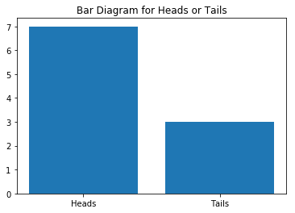

# This is a simple program to visualize the occurence of heads or tails. 


```python
#import the necessary libraries 
import random
import matplotlib.pyplot as plt
% matplotlib inline
```

Now let's define a function that counts the no of heads or tails that was flipped. 


```python
def flip_a_coin(flip_times = 10000):
    no_of_heads = 0
    no_of_tails = 0
    for _ in range(flip_times):
        if random.randint(1,2) == 1:
            no_of_heads += 1
        else:
            no_of_tails += 1
    return  no_of_heads,  no_of_tails
```


```python
heads , tails = flip_a_coin(10)
print("No of heads:" + str(heads) +" & No of tails: " + str(tails) )
```

    No of heads:8 & No of tails: 2


### Let's visualize this data using matplotlib barplot diagram.


```python
plt.bar(['Heads', 'Tails'], [heads, tails])
plt.title('Bar Diagram for Heads or Tails')
```


    Text(0.5,1,'Bar Diagram for Heads or Tails')





This shows head occured more times than tails. Is it just by chace or is our random function biased? To check it, let's flip a coin for 1 million times.


```python
heads , tails = flip_a_coin(1000000)
print("No of heads:" + str(heads) +" & No of tails: " + str(tails) )
```

    No of heads:499382 & No of tails: 500618


```python
plt.bar(['Heads', 'Tails'], [heads, tails])
plt.title('Bar Diagram for Heads or Tails')
```


    Text(0.5,1,'Bar Diagram for Heads or Tails')


This shows that as the number of sample size(flipping times) increases no of tails or heads tend to be have equal probability. So, if we flip infinite no of times, both heads and tails will have equal probability of 50%. 
